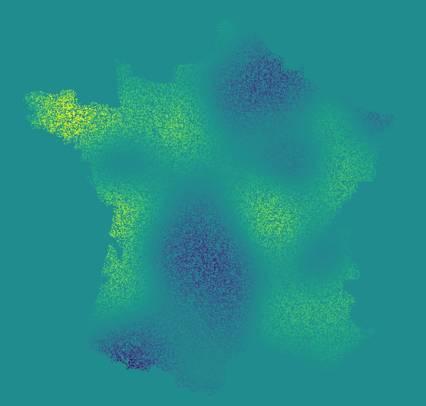

# Spatial Debiased Whittle Likelihood



[](https://debiased-spatial-whittle.readthedocs.io/en/latest/?badge=latest)
[](https://github.com/arthurBarthe/debiased-spatial-whittle/actions/workflows/run_tests_on_push.yaml)
[](https://github.com/arthurBarthe/debiased-spatial-whittle/actions/workflows/pypi.yml)
[](https://mybinder.org/v2/gh/arthurBarthe/debiased-spatial-whittle/master)

## Introduction

This package implements the Spatial Debiased Whittle Likelihood (SDW) as presented in the article of the same name, by the following authors:

- Arthur P. Guillaumin
- Adam M. Sykulski
- Sofia C. Olhede
- Frederik J. Simons

Additionally, the following people have greatly contributed to further developments of the method and its implementation:
- Thomas Goodwin
- Olivia L. Walbert

The SDW extends ideas from the Whittle likelihood and Debiased Whittle Likelihood to random fields and spatio-temporal data. In particular, it directly addresses the bias issue of the Whittle likelihood for observation domains with dimension greater than 2. It also allows us to work with rectangular domains (i.e., rather than square), missing observations, and complex shapes of data.

The documentation is available [here](https://debiased-spatial-whittle.readthedocs.io/en/latest/?badge=latest).

## Installation instructions

### CPU-only

The package can be installed via one of the following methods.

1. Via the use of [Poetry](https://python-poetry.org/), by running the following command:

   ```bash
   poetry add debiased-spatial-whittle
   ```

2. Otherwise, you can directly install via pip:

    ```bash
    pip install debiased-spatial-whittle
    ```

### GPU
The Debiased Spatial Whittle likelihood relies on the Fast Fourier Transform (FFT) for computational efficiency.
GPU implementations of the FFT provide additional computational efficiency (order x100) at almost no additional cost thanks to GPU implementations of the FFT algorithm.

If you want to install with GPU dependencies (Cupy and Pytorch):

1. You need an NVIDIA GPU
2. You need to install the CUDA Toolkit. See for instance Cupy's [installation page](https://docs.cupy.dev/en/stable/install.html).
3. You can install Cupy or pytorch yourself in your environment. Or you can specify an extra to poetry, e.g.

   ```bash
   poetry add debiased-spatial-whittle -E gpu12
   ```
   if you version of the CUDA toolkit is 12.* (use gpu11 if your version is 11.*)

One way to check your CUDA version is to run the following command in a terminal:

```bash
   nvidia-smi
```

You can then switch to using e.g. Cupy instead of numpy as the backend via:

   ```python
    from debiased_spatial_whittle.backend import BackendManager
    BackendManager.set_backend("cupy")
   ```

This should be run before any other import from the debiased_spatial_whittle package.


## PyPI
The package is updated on PyPi automatically on creation of a new
release in Github. Note that currently the version in pyproject.toml
needs to be manually updated. This should be fixed by adding
a step in the workflow used for publication to Pypi.
