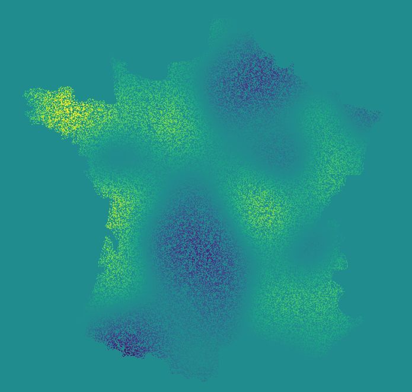

===============
Spatial Debiased Whittle Likelihood
===============

.. image:: https://readthedocs.org/projects/debiased-spatial-whittle/badge/?version=latest
    :target: https://debiased-spatial-whittle.readthedocs.io/en/latest/?badge=latest
    :alt: Documentation Status

Intro
====
This package implements the Spatial Debiased Whittle Likelihood (SDW) as presented
in the article of the same name, by the following authors,

* Arthur P. Guillaumin,
* Adam M. Sykulski,
* Sofia C. Olhede,
* Frederik J. Simons.

The SDW extends ideas from the Whittle likelihood and Debiased
Whittle Likelihood to ramdom fields and spatio-temporal data.
In particular it directly addresses the bias issue of the Whittle
likelihood for observation domains with dimension greater than 2.
It also allows us to work with rectangular domains (i.e. rather than square),
missing observations, and complex shapes of data.

Documentation
====
The documentation_ is hosted on readthedocs. It contains an API reference as well as
examples.

.. _documentation: https://debiased-spatial-whittle.readthedocs.io/en/latest/

Tips
====
Tapering
-----------
While tapering is not necessary for consistency of the SDW, it can be
usefull for finite sample size in order to reduce variance, when
remaining boundary effects are still important. In particular this
is true for spectral models with a strong dynamic range, such as
the squared exponential covariance model.
